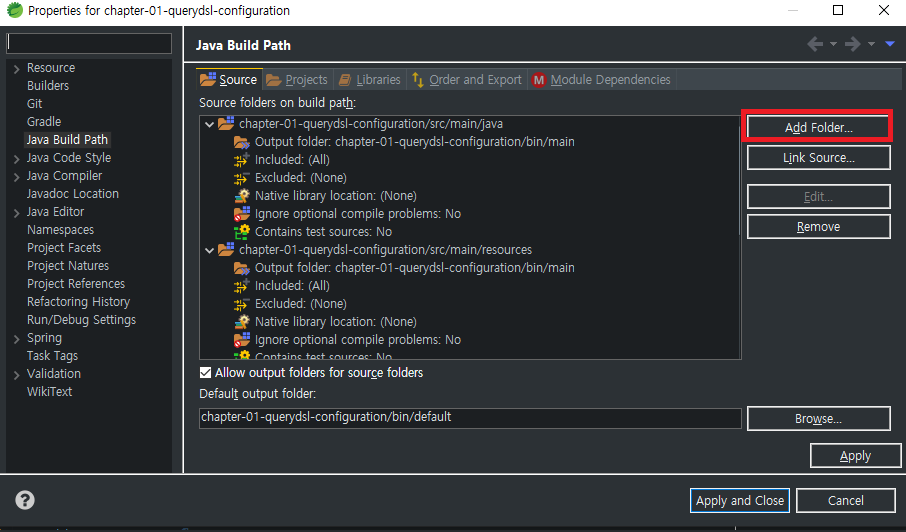
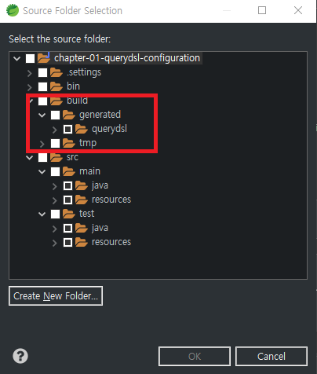

# 프로젝트 구성
 - [Spring Initializr](https://start.spring.io/)에서 스프링 부트 기본 프로젝트를 구성한다.
 - **Querydsl은 오픈소스 프로젝트이므로 다운받은 프로젝트에서 별도의 구성이 필요한다.**
    - **아래의 querydsl `build.gradle` 설정을 참고하라**
    ```gradle
    plugins {
        id 'org.springframework.boot' version '2.4.0'
        id 'io.spring.dependency-management' version '1.0.10.RELEASE'
        
        //querydsl gradle 플러그인
        id "com.ewerk.gradle.plugins.querydsl" version "1.0.10"
        id 'java'
    }

    group = 'com.study.querydsl'
    version = '0.0.1-SNAPSHOT'

    configurations {
        compileOnly {
            extendsFrom annotationProcessor
        }
    }

    dependencies {
        implementation 'com.github.gavlyukovskiy:p6spy-spring-boot-starter:1.5.6' //운영에서는 사용하지 말 것
        implementation 'org.springframework.boot:spring-boot-starter-data-jpa'
        implementation 'org.springframework.boot:spring-boot-starter-web'
        
        //querydsl 추가
        implementation 'com.querydsl:querydsl-jpa'
        
        compileOnly 'org.projectlombok:lombok'
        developmentOnly 'org.springframework.boot:spring-boot-devtools'
        runtimeOnly 'com.h2database:h2'
        annotationProcessor 'org.projectlombok:lombok'
        testImplementation 'org.springframework.boot:spring-boot-starter-test'
    }

    test {
        useJUnitPlatform()
    }

    //querydsl 추가 시작
    def querydslDir = "$buildDir/generated/querydsl"

    querydsl {
        jpa = true
        querydslSourcesDir = querydslDir
    }
    sourceSets {
        main.java.srcDir querydslDir
    }

    configurations {
        querydsl.extendsFrom compileClasspath
    }

    compileQuerydsl {
        options.annotationProcessorPath = configurations.querydsl
    }
    ```
    - `application.yml`은 다음과 같다
    ```yml
    spring:
      datasource:
        url: jdbc:h2:tcp://localhost/~/querydsl
        
        username: sa
        password: 
        driver-class-name: org.h2.Driver
        
      jpa:
        hibernate:
          ddl-auto: create-drop
        properties:
          hibernate:
    #        show_sql: true # System.out을 통해 출력
            format_sql: true
            use_sql_comments: true
            dialect: org.hibernate.dialect.H2Dialect
            default_batch_fetch_size: 100

    logging:
      level:
        org.hibernate.SQL: debug #logger를 통해 출력
        org.hibernate.type: trace #SQL 쿼리 파라미터를 확인할 수 있다
    ```


## Q클래스 생성
- 프로젝트 구성 후 엔티티를 작성하고 나면 **Querydsl이 인식할 수 있는 Q클래스**를 만들어야한다.
  - 그레이들 태스크 `other -> complieQuerydsl`을 실행한다.
  - gradlew를 직접 사용하려면 프로젝트 폴터에서 다음과 같이 입력한다
    - `./gradlew clean`  Q타입클래스를 비롯해서 컴파일되거나 빌드된 파일 전부다 삭제
    - `./gradlew comipleQuerydsl` Q타입클래스 생성 compileJava로도 가능함

- **참고로 querydsl용으로 생성된 Q클래스는 계속 변화될 가능성이 높기 때문에 git 커밋 하지 말것을 권장** 
  - **.gitignore에 build 폴더를 예외대상으로하고 Q타입 클래스는 build폴더에서 생성해서 사용하는 것을 권장**
  - **다른 디렉터리에 빌드할꺼면 그 폴더자체를 .gitignore 대상으로 해야한다**
    
    
## IDE에서 설정
- **Visual Studio Code**에서는 `other -> compileQuerydsl` 태스크 실행 후 창을 리로드한다.
- **이클립스**에서는 Q클래스가 생성되는 디렉터리를 프로젝트의 빌드 패스에 추가해야한다
  - 프로젝트에서 오른쪽 마우스 버튼 클릭
  - Build Path -> Configure Build Path -> Source 탭 이동 후 다음 그림 순으로 설정  
    
    

## 테스트
- 엔티티 클래스 생성한다.
```java
@Entity
@Getter @Setter
public class Hello {
    
    @Id @GeneratedValue
    private Long id;
}
```

- QueryDSL에서 사용하기 위해 엔티티 클래스를 컴파일한다. 
  - gradle `other -> compileQuerydsl` 태스크를 실행한다.
  - 성공적으로 컴파일하면 `build/generated/..`에 `Q+엔티티클래스이름`의 클래스가 생성된다  
  ```java
  /**
   * QHello is a Querydsl query type for Hello
   */
  @Generated("com.querydsl.codegen.EntitySerializer")
  public class QHello extends EntityPathBase<Hello> {
  
      private static final long serialVersionUID = 802099983L;
  
      public static final QHello hello = new QHello("hello");
  
      public final NumberPath<Long> id = createNumber("id", Long.class);
  
      public QHello(String variable) {
          super(Hello.class, forVariable(variable));
      }
  
      public QHello(Path<? extends Hello> path) {
          super(path.getType(), path.getMetadata());
      }
  
      public QHello(PathMetadata metadata) {
          super(Hello.class, metadata);
      }
  
  }
  ```
  - JUnit으로 테스트 실행
  ```java
  package com.study.querydsl;

  import static org.junit.jupiter.api.Assertions.assertEquals;
  
  import javax.persistence.EntityManager;
  import javax.transaction.Transactional;
  
  import org.junit.jupiter.api.Test;
  import org.springframework.beans.factory.annotation.Autowired;
  import org.springframework.boot.test.context.SpringBootTest;
  import org.springframework.test.context.ActiveProfiles;
  
  import com.querydsl.jpa.impl.JPAQueryFactory;
  import com.study.querydsl.domain.Hello;
  import com.study.querydsl.domain.QHello;

  @ActiveProfiles("test")
  @SpringBootTest
  @Transactional
  class QuerydslTest01 {
  
      @Autowired
      EntityManager em;
  
      @Test
      void queryDslTest01() {
          Hello hello = new Hello();
          em.persist(hello);
  
          JPAQueryFactory query = new JPAQueryFactory(em);
  
          // 생성자 파라미터로 alias가 들어감 JPQL에서 from Member m에서 m역할
          QHello qHello = new QHello("h");
  
          Hello result = query.selectFrom(qHello).fetchOne();
  
          assertEquals(result, hello);
          assertEquals(hello.getId(), hello.getId());
      }
  
      @Test
      void queryDslTest02() {
          Hello hello = new Hello();
          em.persist(hello);
  
          JPAQueryFactory query = new JPAQueryFactory(em);
  
          // hello 변수가 alias 역할
          QHello qHello = QHello.hello;
  
          Hello result = query.selectFrom(qHello).fetchOne();
  
          assertEquals(result, hello);
          assertEquals(hello.getId(), hello.getId());
      }
      
  
      @Test
      void queryDslTest03() {
          Hello hello = new Hello();
          em.persist(hello);
  
          JPAQueryFactory query = new JPAQueryFactory(em);
          QHello qHello = QHello.hello;
  
          Hello result = query.select(qHello).from(qHello).fetchOne();
          assertEquals(result, hello);
          assertEquals(hello.getId(), hello.getId());
      }
  }
  ```


