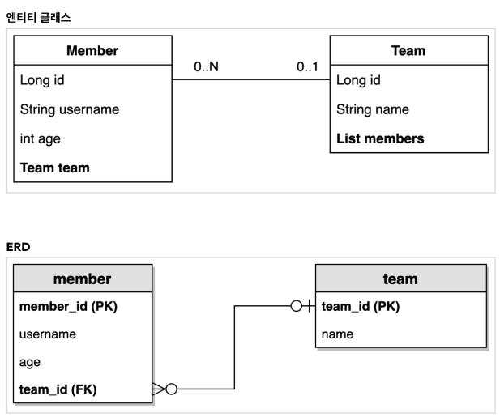

# 예제 도메인 모델과 기본 문법

## 예제 도메인 모델
  
```java
@Entity
@NoArgsConstructor(access = AccessLevel.PROTECTED)
@ToString(of = {"id", "name"})
public class Team {
    
    @Column(name = "TEAM_ID")
    @Id @GeneratedValue
    @Getter
    private Long id;
    
    @Getter @Setter
    private String name;
    
    public Team(String name) {
        this.name = name; 
    }
    
    @OneToMany(mappedBy = "team", cascade = CascadeType.ALL)
    @Getter
    private List<Member> members = new ArrayList<>();
    
}


@Entity
@NoArgsConstructor(access = AccessLevel.PROTECTED)
@ToString(of = {"id", "userName", "age"})
public class Member {
    
    @Column(name = "MEMBER_ID")
    @Id @GeneratedValue
    @Getter
    private Long id;
    
    @Getter @Setter
    private String userName;
    
    @Getter @Setter
    private Integer age;
    
    @ManyToOne(fetch = FetchType.LAZY )
    @JoinColumn(name = "TEAM_ID")
    @Getter
    Team team;
    
    
    public Member(String userName) {
        this.userName = userName;
    }
    
    public Member(String userName, Integer age) {
        this(userName);
        this.age = age;
    }
    
    public Member(String userName, Integer age, Team team) {
        this(userName, age);
        this.team = team;
    }
    
    public void changeTeam(Team team) {
        this.team = team;
        if (!team.getMembers().isEmpty() && !Objects.isNull(getId())) {
            team.getMembers().removeIf(m -> getId().equals(m.getId()));
        }
        team.getMembers().add(this);
    }
}
```
## 기본 문법
- Q타입 사용
  - **static Alias**를 사용하거나 **Alias로 사용할 값을 직접 생성자 파라미터**에 넘겨서 사용하는 것도 가능
  ```java
  @ActiveProfiles("test")
  @SpringBootTest
  @Transactional
  class AliasTest {
  
      @Autowired
      EntityManager em;
  
      @Test
      void queryDslTest01() {
          Hello hello = new Hello();
          em.persist(hello);
  
          JPAQueryFactory query = new JPAQueryFactory(em);
  
          // 생성자 파라미터로 alias가 들어감 JPQL에서 from Member m에서 m역할
          QHello qHello = new QHello("h");
  
          Hello result = query.selectFrom(qHello).fetchOne();
  
          assertEquals(result, hello);
          assertEquals(hello.getId(), hello.getId());
      }
  
      @Test
      void queryDslTest02() {
          Hello hello = new Hello();
          em.persist(hello);
  
          JPAQueryFactory query = new JPAQueryFactory(em);
  
          // hello 변수가 alias 역할
          QHello qHello = QHello.hello;
  
          Hello result = query.selectFrom(qHello).fetchOne();
  
          assertEquals(result, hello);
          assertEquals(hello.getId(), hello.getId());
      }
  }
  ```
- 검색조건 : 다음과 같이 다양하게 검색조건을 활용가능
  - `.eq(param)` : =
  - `.ne(param)` : !=
  - `.eq(param).not()` : !=
  - `.inNotNull()` : IS NOT NULL
  - `.in(param...)` : in ( a, b, c...)
  - `.notIn(param...)` : not in ( a, b, c...)
  - `.between(a, b)` : between a and b
  - `.goe(param)` : >=
  - `.gt(param)` : >
  - `.loe(param)` : <=
  - `.lt(param)` : <
  - `.like("%string")` : like '%string'
  - `.contains("string")` : like '%string%'	
  - `.startsWith("string")` : like "string%"
- 결과조회
  - `fetch()` : 리스트 조회, 데이터 없으면 빈 리스트 반환
  - `fetchOne()` : 단건 조회
    - 결과가 없으면 : `null`
    - 결과가 둘 이상이면 : `com.querydsl.cor.NonUniqueResultException`
  - `fetchFirst()` : `limit(1).fetchOne()`과 동일
  - `fetchResults()` : 페이징 포함한 객체를 반환 **total count 쿼리 추가 실행** - **페이징 쿼리가 복잡해 지면 사용하지 않을 것을 권장**
  - `fetchOunt()` : count 쿼리로 변경해서 count수 조회
- 정렬 : `orderBy`
- 페이징 : `offset`, `limit`
- 집합 : `sum`, `count`, `avg`, `max`, `min`..., `groupBy`, `having 조건`
- 조인
- `fetch` 조인 : 조회대상의 연관관계 엔티티 필드까지 조회
- 서브쿼리 : `JPAExpressions` 활용
  - `where`와 `select`(하이버네이트 기준)절 서브쿼리 지원한다.
  - **단 from 절 서브쿼리는 지원되지 않는다.(JPA스펙)**
    - `from` 절 서브쿼리는 `join`으로 **변경**하거나, 애플리케이션에서 쿼리를 2번 분리해서 실행하거나, `nativeSQL`을 사용한다.
- case문
- 상수와 문자더하기