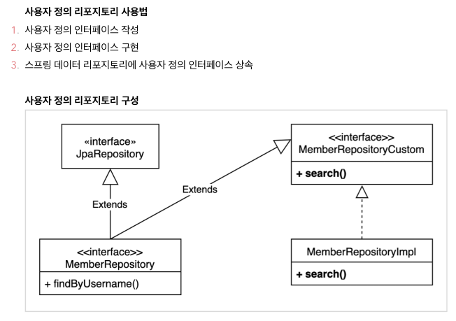

# Spring Data Jpa와 Querydsl 혼합 사용

- Spring Data Jpa 리포지토리와 Querydsl 리포지토리 병합
  - Querydsl과 Spring Data Jpa 페이징 연동
    - count 쿼리를 생략 가능한 경우 생략해서 처리할 수도 있음
      - `org.springframework.data.support.PageableExecutionUtils`를 활용
        - 페이지 시작이면서 컨텐츠 사이즈가 페이지 사이즈보다 작을때
        - 마지막 페이지 일때 (**offset + 컨텐츠 사이즈를 더해서 전체사이즈를 구한다**)
 - 정렬 : SpringDataJpa의 정렬을 Querydsl의 정렬(OrderSpecifier)로 변경
   - 단 단순한 엔티티 하나일때는 가능하지만 조인시에는 안되는 방법
   - **조건이 복잡해 지면 별도의 파라미터를 받아서 직접 받아서 처리하는 것을 권장**

## 예제

`MemberRepository` Spring Data JPA 리포지토리
```java
public interface MemberRepository extends JpaRepository<Member, Long>, MemberRepositoryCustom, QuerydslPredicateExecutor<Member> {
    List<Member> findByUserName(String userName);
}
```
**사용자 정의 리포지토리 사용법**  
1. 사용자 정의 인터페이스 작성  
2. 사용자 정의 인터페이스 구현  
3. 스프링 데이터 리포지토리에 사용자 정의 인터페이스 상속  
  

`MemberRepositoryCustom`
```java
public interface MemberRepositoryCustom {
    List<MemberTeamDTO> searchByBuilder(MemberSearchCondition condition);
    List<MemberTeamDTO> searchByWhereClause(MemberSearchCondition condition);
    
    //페이징
    Page<MemberTeamDTO> searchPageSimple(MemberSearchCondition condition, Pageable pageable);
    Page<MemberTeamDTO> searchPageComplex(MemberSearchCondition condition, Pageable pageable);
    
    //total count 최적화
    Page<MemberTeamDTO> searchPageOptimal(MemberSearchCondition condition, Pageable pageable);
    
    //sort
    Page<MemberTeamDTO> searchPageBySort(MemberSearchCondition condition, Pageable pageable);
}
```
`MemberRepositoryCustom`를 구현한 `MemberRepositoryImpl`
```java
public class MemberRepositoryImpl implements MemberRepositoryCustom {

    private final EntityManager em;
    private final JPAQueryFactory queryFactory;

    public MemberRepositoryImpl(EntityManager em) {
        this.em = em;
        this.queryFactory = new JPAQueryFactory(em); // 스프링 빈으로 등록해서 처리해도됨
    }

    /**
     * fetchResults()는 데이터와 토탈카운트를 같이 가져온다.
     */
    @Override
    public Page<MemberTeamDTO> searchPageSimple(MemberSearchCondition condition, Pageable pageable) {
        QueryResults<MemberTeamDTO> results = 
                queryFactory
                .select(new QMemberTeamDTO(member.id, member.userName, member.age, team.id, team.name))
                .from(member)
                .leftJoin(member.team, team)
                .where(userNameEq(condition.getUserName()), 
                        teamNameEq(condition.getTeamName()),
                        ageGoe(condition.getAgeGoe()), 
                        ageLoe(condition.getAgeLoe()))
                .offset(pageable.getOffset())
                .limit(pageable.getPageSize())
                .fetchResults();

        List<MemberTeamDTO> content = results.getResults();
        long total = results.getTotal();

        return new PageImpl<>(content, pageable, total);
    }

    /**
     * 데이터 가져오는 쿼리와 Total count 쿼리를 분리 - 데이터가 많을 때 최적화를 위해 사용할 것을 추천
     */
    @Override
    public Page<MemberTeamDTO> searchPageComplex(MemberSearchCondition condition, Pageable pageable) {
        List<MemberTeamDTO> content = 
                queryFactory
                .select(new QMemberTeamDTO(member.id, member.userName, member.age, team.id, team.name))
                .from(member)
                .leftJoin(member.team, team)
                .where(userNameEq(condition.getUserName()), 
                       teamNameEq(condition.getTeamName()),
                       ageGoe(condition.getAgeGoe()), 
                       ageLoe(condition.getAgeLoe()))
                .offset(pageable.getOffset())
                .limit(pageable.getPageSize())
                .fetch();

        long total = 
                queryFactory
                .select(member)
                .from(member)
                .leftJoin(member.team, team)
                .where(userNameEq(condition.getUserName()), 
                       teamNameEq(condition.getTeamName()),
                       ageGoe(condition.getAgeGoe()), 
                       ageLoe(condition.getAgeLoe()))
                .fetchCount();

        return new PageImpl<>(content, pageable, total);
    }

    /**
     * total count 최적화
     */
    @Override
    public Page<MemberTeamDTO> searchPageOptimal(MemberSearchCondition condition, Pageable pageable) {
        List<MemberTeamDTO> content = 
                queryFactory
                .select(new QMemberTeamDTO(member.id, member.userName, member.age, team.id, team.name))
                .from(member)
                .leftJoin(member.team, team)
                .where(userNameEq(condition.getUserName()), 
                       teamNameEq(condition.getTeamName()),
                       ageGoe(condition.getAgeGoe()), 
                       ageLoe(condition.getAgeLoe()))
                .offset(pageable.getOffset())
                .limit(pageable.getPageSize())
                .fetch();

        /**
         * 람다를 이용해서 count 쿼리가 조건에 따라 호출되어 쿼리 최적화
         */
        return PageableExecutionUtils.getPage(content, pageable, () -> {
            return queryFactory
                    .select(member)
                    .from(member)
                    .leftJoin(member.team, team)
                    .where(userNameEq(condition.getUserName()), 
                           teamNameEq(condition.getTeamName()),
                           ageGoe(condition.getAgeGoe()), 
                           ageLoe(condition.getAgeLoe()))
                    .fetchCount();
        });
    }

    /**
     * sorting (정렬)
     */
    @Override
    public Page<MemberTeamDTO> searchPageBySort(MemberSearchCondition condition, Pageable pageable) {
        JPAQuery<MemberTeamDTO> query = 
                queryFactory
                .select(new QMemberTeamDTO(member.id, member.userName, member.age, team.id, team.name))
                .from(member)
                .where(userNameEq(condition.getUserName()), 
                        teamNameEq(condition.getTeamName()),
                        ageGoe(condition.getAgeGoe()), 
                        ageLoe(condition.getAgeLoe()));
        
        pageable.getSort().forEach(sort -> {
            Sort.Order o = sort;
            PathBuilder pathBuilder = new PathBuilder(member.getType(), member.getMetadata());
            query.orderBy(new OrderSpecifier(o.isAscending() ? Order.ASC : Order.DESC, pathBuilder.get(o.getProperty())));
        });
        
        List<MemberTeamDTO> content = query.fetch();
        
        return PageableExecutionUtils.getPage(content, pageable, () -> {
            return queryFactory
                    .select(member)
                    .from(member)
                    .leftJoin(member.team, team)
                    .where(userNameEq(condition.getUserName()), 
                           teamNameEq(condition.getTeamName()),
                           ageGoe(condition.getAgeGoe()), 
                           ageLoe(condition.getAgeLoe()))
                    .fetchCount();
        });
    }

    @Override
    public List<MemberTeamDTO> searchByBuilder(MemberSearchCondition condition) {
        BooleanBuilder builder = new BooleanBuilder();
        if (StringUtils.hasText(condition.getUserName())) {
            builder.and(member.userName.eq(condition.getUserName()));
        }

        if (StringUtils.hasText(condition.getTeamName())) {
            builder.and(team.name.eq(condition.getTeamName()));
        }

        if (!Objects.isNull(condition.getAgeGoe())) {
            builder.and(member.age.goe(condition.getAgeGoe()));
        }

        if (!Objects.isNull(condition.getAgeLoe())) {
            builder.and(member.age.loe(condition.getAgeLoe()));
        }
        return queryFactory
                .select(new QMemberTeamDTO(member.id, member.userName, member.age, team.id, team.name))
                .from(member)
                .leftJoin(member.team, team)
                .where(builder)
                .fetch();
    }

    @Override
    public List<MemberTeamDTO> searchByWhereClause(MemberSearchCondition condition) {
        return queryFactory
                .select(new QMemberTeamDTO(member.id, member.userName, member.age, team.id, team.name))
                .from(member)
                .leftJoin(member.team, team)
                .where(userNameEq(condition.getUserName()), 
                       teamNameEq(condition.getTeamName()),
                       ageGoe(condition.getAgeGoe()), 
                       ageLoe(condition.getAgeLoe()))
                .fetch();
    }

    private BooleanExpression ageLoe(Integer ageLoe) {
        return Objects.isNull(ageLoe) ? null : member.age.loe(ageLoe);
    }

    private BooleanExpression ageGoe(Integer ageGoe) {
        return Objects.isNull(ageGoe) ? null : member.age.goe(ageGoe);
    }

    private BooleanExpression teamNameEq(String teamName) {
        return (!StringUtils.hasText(teamName)) ? null : team.name.eq(teamName);
    }

    private BooleanExpression userNameEq(String userName) {
        return (!StringUtils.hasText(userName)) ? null : member.userName.eq(userName);
    }
}
```
테스트 코드
```java
class MemberRepositoryTest {

    @Autowired
    EntityManager em;
    
    @Autowired
    MemberRepository memberRepository;
    
    @BeforeEach
    void before() {
        
        //given
        Team team1 = new Team("team1");
        Team team2 = new Team("team2");
        Team team3 = new Team("team3");
        em.persist(team1);
        em.persist(team2);
        em.persist(team3);
        
        Member member1 = new Member("member1", 10, team1);
        Member member2 = new Member("member2", 20, team1);
        Member member3 = new Member("member3", 30, team1);
        Member member4 = new Member("member4", 40, team2);
        Member member5 = new Member("member5", 50, team2);
        Member member6 = new Member("member6", 60, team2);
        Member member7 = new Member("member7", 70, team2);
        
        em.persist(member1);
        em.persist(member2);
        em.persist(member3);
        em.persist(member4);
        em.persist(member5);
        em.persist(member6);
        em.persist(member7);
        em.flush();
        em.clear();
    }
    
    @Test
    void searchInAndConditionUsingBuilder() {
        MemberSearchCondition condition = new MemberSearchCondition();
        condition.setAgeGoe(30);
        condition.setAgeLoe(60);
        condition.setTeamName("team2");
        
        List<MemberTeamDTO> collect = memberRepository.searchByBuilder(condition);
        collect.forEach(System.out::println);
        
        assertEquals(3, collect.size());
        assertThat(collect).extracting("userName")
                           .containsExactly("member4", "member5", "member6");
        
    }    
    
    @Test
    void searchInAndConditionUsingWhereClause() {
        MemberSearchCondition condition = new MemberSearchCondition();
        condition.setAgeGoe(30);
        condition.setAgeLoe(60);
        condition.setTeamName("team2");
        
        List<MemberTeamDTO> collect = memberRepository.searchByWhereClause(condition);
        collect.forEach(System.out::println);
        
        assertEquals(3, collect.size());
        assertThat(collect).extracting("userName")
                           .containsExactly("member4", "member5", "member6");
    }
    
    @Test
    void searchPageSimple() {
        MemberSearchCondition condition = new MemberSearchCondition();
        condition.setAgeGoe(30);
        condition.setAgeLoe(60);
        condition.setTeamName("team2");
        
        Page<MemberTeamDTO> result = memberRepository.searchPageSimple(condition, PageRequest.of(0, 3));
        
        assertThat(result.getSize()).isEqualTo(3);
        assertThat(result.getContent()).extracting("userName")
                                       .containsExactly("member4", "member5", "member6");
    }
    
    
    @Test
    void searchComplex() {
        MemberSearchCondition condition = new MemberSearchCondition();
        condition.setAgeGoe(30);
        condition.setAgeLoe(60);
        condition.setTeamName("team2");
        
        Page<MemberTeamDTO> result = memberRepository.searchPageComplex(condition, PageRequest.of(0, 3));
        
        assertThat(result.getSize()).isEqualTo(3);
        assertThat(result.getContent()).extracting("userName")
                                       .containsExactly("member4", "member5", "member6");
        
        assertEquals(3L, result.getTotalElements());
    }
    
    @Test
    void searchOptimal() {
        MemberSearchCondition condition = new MemberSearchCondition();
        condition.setAgeGoe(30);
        condition.setAgeLoe(60);
        condition.setTeamName("team2");
        
        Page<MemberTeamDTO> result = memberRepository.searchPageOptimal(condition, PageRequest.of(0, 3));
        
        assertThat(result.getSize()).isEqualTo(3);
        assertThat(result.getContent()).extracting("userName")
                                       .containsExactly("member4", "member5", "member6");
        
        assertEquals(3L, result.getTotalElements());
    }
    
    @Test
    void searchPageBySort() {
        MemberSearchCondition condition = new MemberSearchCondition();
        condition.setAgeGoe(50);
        condition.setAgeLoe(70);
        condition.setTeamName("team2");
        
        Page<MemberTeamDTO> result = memberRepository.searchPageBySort(condition, PageRequest.of(0, 3, Sort.by(Direction.DESC, "userName")));
        
        assertThat(result.getSize()).isEqualTo(3);
        assertThat(result.getContent()).extracting("userName")
                                       .containsExactly("member7", "member6", "member5");
        
        assertEquals(3L, result.getTotalElements());
    }
}
```


## 번외
- QuerydslPredicateExecutor
  - Spring Data Jpa 인터페이스를 상속한 리포지토리 인터페이스에서 QuerydslPredicateExecutor를 상속받는다.
  - Spring Data Jpa 인터페이스에서 제공하는 기본 메서드 파라미터에 Querydsl 조건식 사용가능
  - **묵시적 조인은 가능하지만 left join이 불가능하다**
  - **클라이언트가 Querydsl에 의존해야한다. 서비스 클래스가 Querydsl이라는 구현 기술에 의존해야한다**
  - **실무의 복잡한 환경에서 한계가 있음**
- [Querydsl Web](https://docs.spring.io/spring-data/jpa/docs/2.2.3.RELEASE/reference/html/#core.web.type-safe)
  - **단순 조건만 가능**
  - **컨트롤러가 Querydsl에 의존**
- QuerydslRepositorySupport
  - 스프링 데이터가 제공하는 페이징을 편리하게 변환 - **(단!Sort는 오류 발생)**
  - 페이징과 카운트 쿼리 분리 가능
  - 스프링 데이터 Sort 지원
  - select() , selectFrom() 으로 시작 가능
  - EntityManager , QueryFactory 제공
  - **Querydsl3.x버전 대상으로 만들었으며 스프링 데이터 Sort기능이 정상 동작하지 않음**
- Querydsl지원 클래스를 직접만들기
